---
tags:
  - Backend
  - Banco de Dados
  - Arquitetura
---

# Banco de Dados

## PostgreSQL 16 com RLS

O EnerSync utiliza PostgreSQL 16 com **Row-Level Security** para isolamento multi-tenant.

### Migrations (Alembic)

| Migration | Conteúdo |
|-----------|----------|
| `0001_initial_schema` | tenants + users + RLS policies |
| `0002_gd_domain` | 6 tabelas GD + 8 enums + 5 RLS policies |
| `0003_billing_module` | faturas_internas + service_fee + RLS |
| `0004_audit_log` | audit_logs + AuditAction enum + RLS |
| `0005_notificacoes` | notificacoes + 2 enums + RLS + índices |
| `0006_permissions` | permissions + role_permissions + seed data |
| `0007_user_permissions` | 4 codenames de user + role_permissions |
| `0008_tenant_settings` | 13 colunas config no tenant + 2 perms |
| `0009_task_permissions` | 2 permissions de tasks + role_permissions |

### RLS Policies

Cada tabela tenant-scoped tem uma policy:

```sql
CREATE POLICY tenant_isolation ON <tabela>
    USING (tenant_id = current_setting('app.current_tenant')::uuid);
```

**Exceções** (sem RLS):

- `tenants` — tabela raiz
- `distribuidoras` — dados compartilhados entre tenants
- `permissions` / `role_permissions` — configuração global

### Tabelas

```mermaid
erDiagram
    tenants {
        uuid id PK
        string name
        string slug UK
        string company_name
        string smtp_host
        decimal default_service_fee
    }
    users {
        uuid id PK
        uuid tenant_id FK
        string email UK
        string full_name
        string role
        bool is_active
    }
    distribuidoras {
        uuid id PK
        string name
        string code UK
        string state
    }
    usinas {
        uuid id PK
        uuid tenant_id FK
        uuid distribuidora_id FK
        string name
        enum type
        enum status
        decimal capacity_kw
    }
    unidades_consumidoras {
        uuid id PK
        uuid tenant_id FK
        uuid distribuidora_id FK
        string uc_number
        string holder_name
        enum connection_type
        enum tariff_group
    }
    contratos {
        uuid id PK
        uuid tenant_id FK
        uuid usina_id FK
        uuid uc_id FK
        decimal quota_percentage
        decimal quota_max_kwh
        decimal service_fee_percentage
        enum status
    }
    faturas_distribuidora {
        uuid id PK
        uuid tenant_id FK
        uuid uc_id FK
        date reference_month
        decimal consumption_kwh
        decimal bill_amount_brl
    }
    creditos_energia {
        uuid id PK
        uuid tenant_id FK
        uuid usina_id FK
        date reference_month
        date expiration_date
        decimal amount_kwh
        enum status
    }
    faturas_internas {
        uuid id PK
        uuid tenant_id FK
        uuid contrato_id FK
        uuid fatura_distribuidora_id FK
        date reference_month
        decimal economia_kwh
        decimal economia_brl
        decimal valor_cobranca_brl
        enum status
    }
    audit_logs {
        uuid id PK
        uuid tenant_id FK
        uuid user_id FK
        enum action
        string entity_type
        uuid entity_id
        json details
    }
    notificacoes {
        uuid id PK
        uuid tenant_id FK
        enum notification_type
        enum priority
        string title
        string message
        bool is_read
    }
```



### Permissões RBAC

**44 codenames** distribuídos em 3 roles:

| Role | Permissões | Exemplos |
|------|-----------|----------|
| **ADMIN** | 44 (todas) | `*.view`, `*.create`, `*.update`, `*.delete`, `settings.update`, `tasks.execute` |
| **MANAGER** | 24 | Sem `*.delete`, sem `settings.update`, sem `tasks.execute` |
| **VIEWER** | 14 | Somente `*.view` (read-only) |
