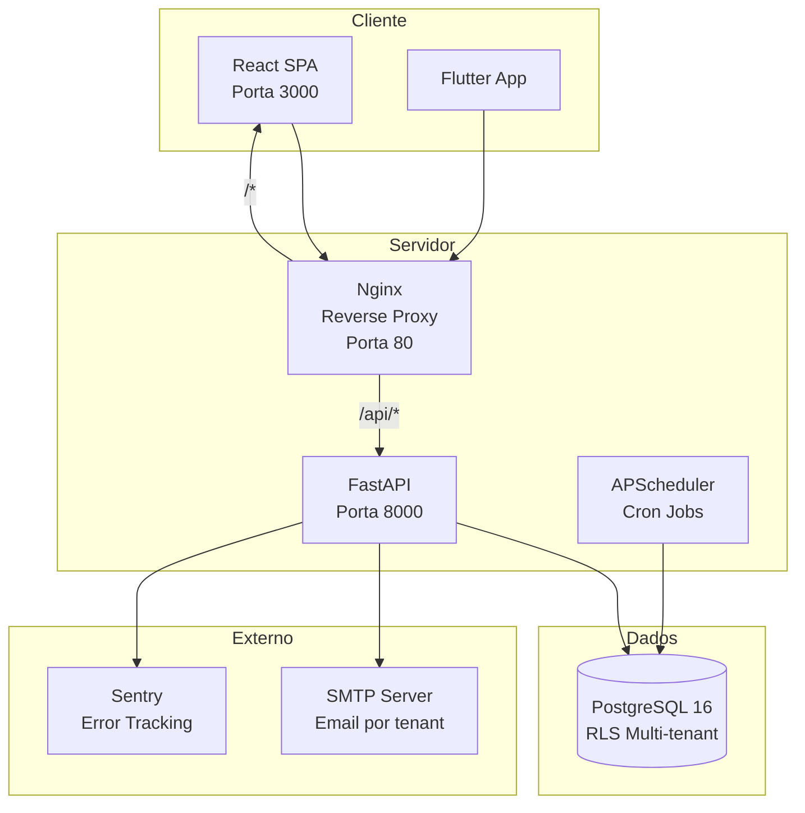
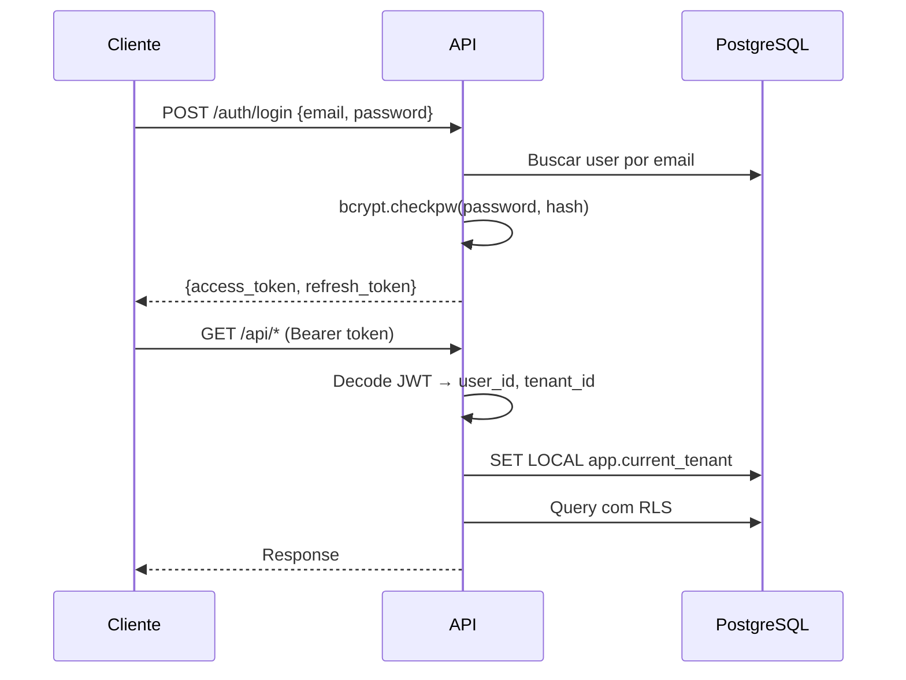

---
tags:
  - Arquitetura
  - Backend
  - Frontend
  - DevOps
---

# Arquitetura — Visão Geral

## Diagrama de Componentes



## Multi-tenancy com RLS

O isolamento de dados é feito no nível do banco via **Row-Level Security** do PostgreSQL:

```sql
CREATE POLICY tenant_isolation ON usinas
    USING (tenant_id = current_setting('app.current_tenant')::uuid);
```

A cada request, o middleware de tenant:

1. Extrai o `tenant_id` do JWT
2. Executa `SET LOCAL app.current_tenant = '{tenant_id}'`
3. Todas as queries ficam automaticamente filtradas

!!! warning "asyncpg e SET LOCAL"
    asyncpg **não** suporta bind params em comandos SET. A solução é validar o UUID antes e usar f-string.

## Autenticação



- **JWT**: python-jose com algoritmo HS256
- **Hash**: bcrypt direto (sem passlib)
- **Refresh**: Token de longa duração para renovar o access token
- **RBAC**: 44 permissões distribuídas em 3 roles (ADMIN, MANAGER, VIEWER)

## Observabilidade

| Componente | Tecnologia | Descrição |
|------------|------------|-----------|
| **Logs** | structlog | JSON em prod, console em dev |
| **Request ID** | Middleware | UUID por request, header `X-Request-ID` |
| **Access Log** | Middleware | method, path, status, duration_ms |
| **Error Tracking** | Sentry SDK | Opcional, via `SENTRY_DSN` |
| **Health Check** | `/health` | DB status, version, uptime |
| **Audit Trail** | AuditLog model | Quem + o quê + quando (todas entidades) |
