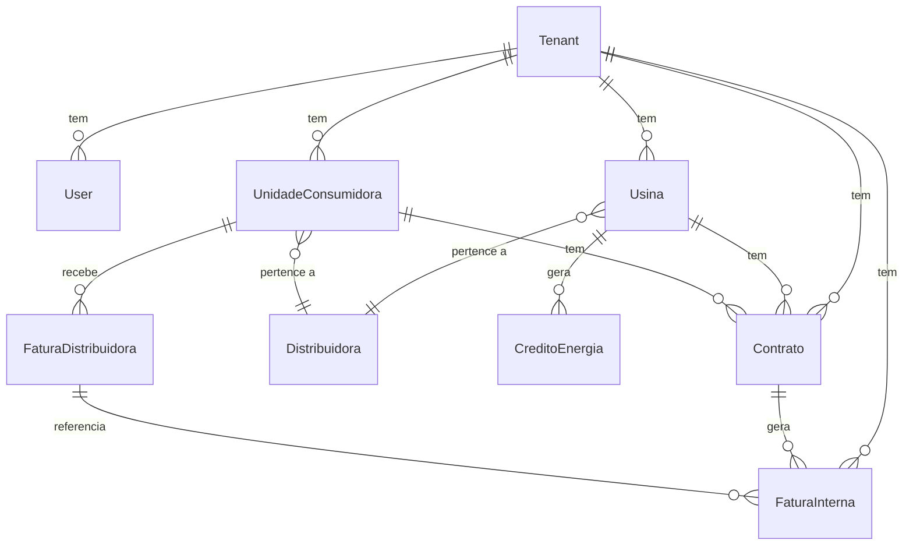

---
tags:
  - Domínio
  - Backend
  - Banco de Dados
---

# Entidades e Relacionamentos

## Diagrama

## Detalhamento

### Tenant
Empresa cliente do SaaS. Cada tenant é isolado via Row-Level Security no PostgreSQL.

- Campos de configuração: `company_name`, `company_document`, `company_phone`, etc.
- Configuração SMTP própria para envio de emails
- `default_service_fee`: percentual padrão de cobrança

### User
Usuário do sistema, pertence a um tenant.

- **Roles**: `ADMIN` (44 perms), `MANAGER` (24 perms), `VIEWER` (14 perms)
- Auth via JWT (access + refresh tokens)
- Soft-delete com `is_active`

### Distribuidora
Empresa distribuidora de energia (dados compartilhados, **sem** `tenant_id`).

- Identificada pelo código ANEEL
- Estado (UF)
- Exemplos: CEMIG, Enel, CPFL

### Usina
Planta geradora de energia (solar, eólica, etc.), pertence a um tenant.

- Vinculada a uma distribuidora
- Capacidade instalada (kW)
- Status: active, inactive, under_construction

### Unidade Consumidora (UC)
Ponto de consumo de energia, pertence a um tenant.

- Número da UC na distribuidora
- Titular, tipo de conexão, grupo tarifário
- Vinculada a uma distribuidora

### Contrato
Vínculo entre uma usina e uma UC, definindo o percentual de quota.

- `quota_percentage`: quanto da produção da usina vai para essa UC
- `quota_max_kwh`: limite máximo em kWh
- `service_fee_percentage`: percentual de cobrança do serviço
- **Regra**: soma das quotas por usina ≤ 100%

### Fatura Distribuidora
Conta de luz da UC, uma por mês de referência.

- `reference_month`, `consumption_kwh`, `bill_amount_brl`
- **Unique**: `(uc_id, reference_month)`
- Importável via CSV/Excel

### Crédito de Energia
Energia injetada pela usina que pode ser usada para compensar faturas.

- Mês de referência + 60 meses = data de expiração
- Status: `available` → `allocated` → `used` → `expired`

### Fatura Interna
Cobrança do serviço de gestão GD (gerada pelo sistema).

- `economia_kwh` × `tarifa_media` = `economia_brl`
- `economia_brl` × `service_fee_percentage` / 100 = `valor_cobranca_brl`
- `due_date` = fatura da distribuidora + 15 dias
- **Unique**: `(contrato_id, reference_month)`
