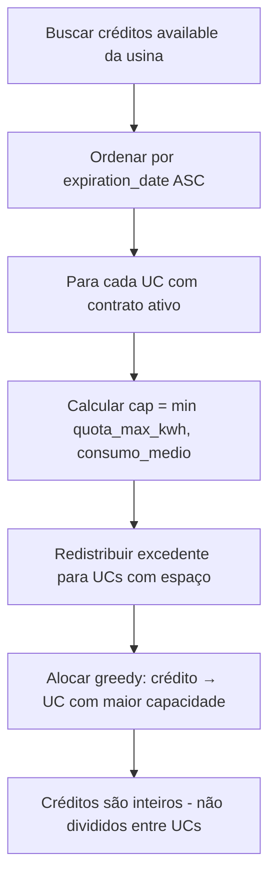

# Regras de Negócio

## Regras Gerais

| # | Regra | Detalhe |
|---|-------|---------|
| 1 | **Quota ≤ 100%** | Soma dos contratos ativos de uma usina não pode exceder 100% |
| 2 | **Expiração de crédito** | Créditos expiram 60 meses após o mês de referência |
| 3 | **Fatura única** | Apenas uma fatura por UC por mês de referência |
| 4 | **Distribuidora compartilhada** | Mesma CEMIG para todos os tenants (sem tenant_id) |
| 5 | **Soft-delete** | Entidades nunca são deletadas fisicamente (`is_active=False`) |

## Otimizador de Alocação

O algoritmo distribui créditos de energia das usinas para as UCs, priorizando créditos próximos de expirar.

### Algoritmo FIFO Global



1. Busca todos créditos `available` da usina, ordenados por `expiration_date ASC`
2. Para cada UC com contrato ativo, calcula: `cap = min(quota_max_kwh, consumo_medio)`
3. Redistribui excedente para UCs com espaço entre cap e quota_max
4. Aloca greedy: para cada crédito, atribui à UC com maior capacidade restante
5. **Créditos são inteiros** — não podem ser divididos entre UCs

### Endpoints

| Endpoint | Descrição |
|----------|-----------|
| `POST /otimizador/simular` | Preview da alocação (não persiste) |
| `POST /otimizador/executar` | Executa e persiste a alocação |

### Métricas Calculadas

- **Tarifa média**: `sum(bill_brl) / sum(consumption_kwh)` das últimas 12 faturas
- **Economia estimada**: `credits_allocated_kwh × tarifa_media`
- **Alertas**: créditos expirando em 30 e 60 dias

## Módulo de Faturamento

Cobrança do serviço de gestão GD — o Grupo JLM cobra um percentual da economia gerada.

### Fórmulas

```
economia_kwh = credits_compensated_kwh (da fatura distribuidora)
economia_brl = economia_kwh × tarifa_media
valor_cobranca_brl = economia_brl × service_fee_percentage / 100
due_date = fatura_distribuidora.due_date + 15 dias
```

### Endpoints

| Endpoint | Descrição |
|----------|-----------|
| `POST /faturamento/gerar` | Gera fatura individual |
| `POST /faturamento/gerar-periodo` | Gera faturas em lote por mês |
| `GET/PATCH/DELETE /faturamento/{id}` | CRUD individual |
| `POST /faturamento/bulk` | Ações em lote (marcar pago, cancelar) |
| `GET /faturamento/{id}/pdf` | Download PDF da fatura |
| `POST /relatorios/financeiro` | Resumo por período com GROUP BY UC |
