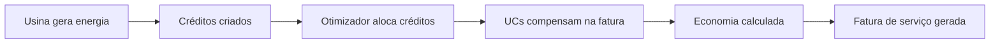

# Domínio: Geração Distribuída (GD)

## Conceito

No Brasil, consumidores podem gerar energia (solar, eólica, etc.) e injetar na rede da distribuidora. A energia injetada gera **créditos** que podem ser compensados nas faturas de **unidades consumidoras** vinculadas por **contratos**.

O EnerSync é a plataforma que gerencia todo esse fluxo para empresas de gestão de GD — desde o cadastro de usinas e UCs até a cobrança do serviço prestado.

## Fluxo Principal

## Modelo de Negócio

O **Grupo JLM** atua como gestor de GD:

1. Gerencia usinas e unidades consumidoras dos seus clientes
2. Otimiza a distribuição de créditos de energia entre UCs
3. Cobra um **percentual da economia gerada** (service fee) como remuneração

## Entidades Regulatórias

| Entidade | Descrição |
|----------|-----------|
| **ANEEL** | Agência Nacional de Energia Elétrica — regula o setor |
| **Distribuidora** | Empresa que distribui energia (CEMIG, Enel, CPFL, etc.) |
| **Geração Distribuída** | Modalidade onde consumidores geram e injetam energia na rede |
| **Crédito de Energia** | kWh injetado que pode ser compensado em até 60 meses |

## Enums do Domínio

| Enum | Valores |
|------|---------|
| `UsinaType` | solar, wind, hydro, biomass |
| `UsinaStatus` | active, inactive, under_construction |
| `UCStatus` | active, inactive |
| `ConnectionType` | monofasico, bifasico, trifasico |
| `TariffGroup` | B1, B2, B3, A1, A2, A3, A3a, A4, AS |
| `ContratoStatus` | active, suspended, terminated |
| `FaturaStatus` | pending, processed, error |
| `CreditoStatus` | available, allocated, used, expired |
| `FaturaInternaStatus` | pending, paid, overdue, cancelled |
