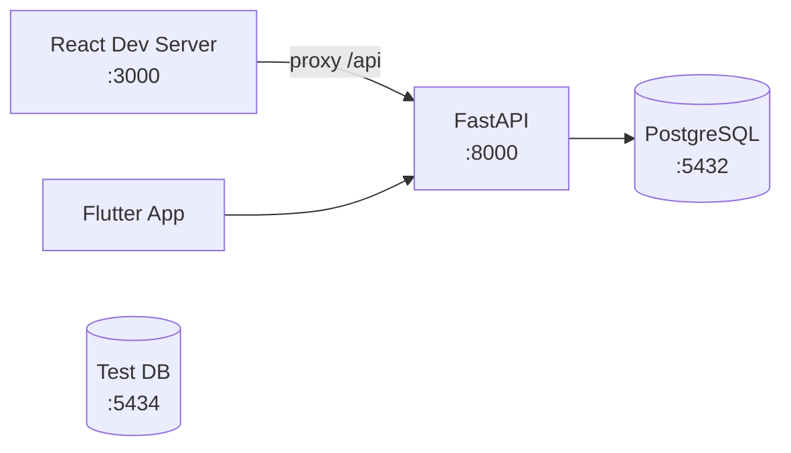

# Ambiente Local

## Pré-requisitos Globais

| Ferramenta | Versão | Instalação |
|------------|--------|------------|
| Docker | 24+ | [docker.com](https://docker.com) |
| Node.js | 22+ | `nvm install 22` |
| Python | 3.12+ | Via sistema ou pyenv |
| uv | latest | `curl -LsSf https://astral.sh/uv/install.sh \| sh` |
| Flutter | 3.38+ | [flutter.dev](https://flutter.dev) |

## Arquitetura Local



## Setup Completo

### 1. PostgreSQL

```bash
# Dev DB
docker run -d --name energy_db \
  -e POSTGRES_USER=energy \
  -e POSTGRES_PASSWORD=energy123 \
  -e POSTGRES_DB=energy_saas \
  -p 5432:5432 \
  postgres:16-alpine

# Test DB
docker run -d --name energy_test_db \
  -e POSTGRES_USER=energy \
  -e POSTGRES_PASSWORD=energy123 \
  -e POSTGRES_DB=energy_saas_test \
  -p 5434:5432 \
  postgres:16-alpine
```

### 2. Backend

```bash
cd enersync-api
export PATH="$HOME/.local/bin:$PATH"
uv sync --all-extras
uv run alembic upgrade head
uv run uvicorn energy_saas.main:app --reload
```

### 3. Frontend

```bash
cd enersync-web
nvm use 22
npm install
npm run dev  # localhost:3000, proxy /api → :8000
```

### 4. Mobile

```bash
cd enersync-mobile
flutter pub get
dart run build_runner build --delete-conflicting-outputs
flutter run
```

## Portas

| Serviço | Porta |
|---------|-------|
| Frontend (dev) | 3000 |
| API (dev) | 8000 |
| PostgreSQL (dev) | 5432 |
| PostgreSQL (test) | 5434 |

## Dicas

!!! tip "nvm use 22"
    Sempre execute `nvm use 22` antes de qualquer comando npm. Vite 7 requer Node 22+.

!!! tip "uv no PATH"
    Se `uv` não for encontrado: `export PATH="$HOME/.local/bin:$PATH"`

!!! warning "Docker Desktop"
    Docker Desktop pode recriar containers automaticamente ao iniciar, ocupando portas. Verifique com `docker ps`.
