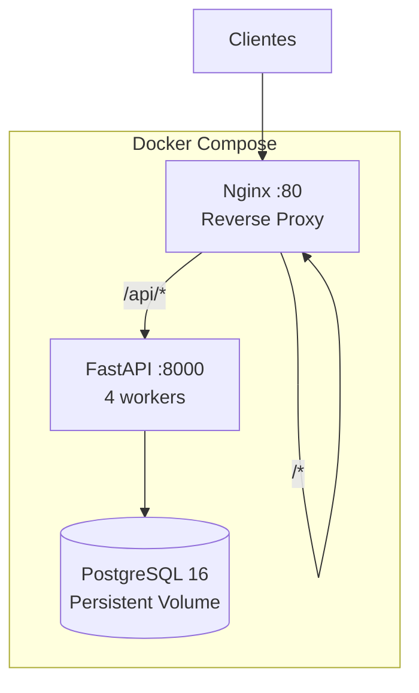

---
tags:
  - DevOps
  - Docker
---

# Deploy

## Arquitetura de Produção



## docker-compose.prod.yml

Três serviços com health checks e depends_on:

- **postgres**: PostgreSQL 16 Alpine com volume persistente
- **api**: Python 3.12 slim + uvicorn (4 workers) + alembic auto-migrate
- **web**: Nginx 1.27 Alpine servindo o build React + proxy reverso

## Build e Deploy

```bash
cd enersync-api/infra/docker

# Criar .env.prod a partir do template
cp .env.prod.example .env.prod
# Editar com valores reais

# Build e start
docker compose -f docker-compose.prod.yml --env-file .env.prod up -d --build
```

## Variáveis de Produção

!!! danger "Variáveis obrigatórias"
    O docker-compose.prod.yml usa `${VAR:?msg}` — falha se variáveis não estiverem definidas.

| Variável | Descrição |
|----------|-----------|
| `POSTGRES_USER` | Usuário do banco |
| `POSTGRES_PASSWORD` | Senha do banco |
| `POSTGRES_DB` | Nome do banco |
| `SECRET_KEY` | Chave JWT (gerar com `openssl rand -hex 32`) |
| `WEB_PORT` | Porta exposta (default: 80) |

## Nginx

O `nginx.conf` configura:

- **Gzip** para text, json, js, css
- **Cache** de `/assets/` por 1 ano (hash no filename)
- **Proxy** `/api/` → backend (com strip de prefix)
- **SPA fallback** → `index.html` para rotas do React

!!! warning "Trailing slash no proxy_pass"
    `proxy_pass http://api:8000/;` — o trailing slash é **crucial** para strip do prefix `/api`.

## Health Checks

- **API**: `python -c "import urllib.request; urllib.request.urlopen('http://localhost:8000/health')"`
- **Nginx**: `wget --no-verbose --tries=1 --spider http://localhost:80/`
- **PostgreSQL**: `pg_isready`

!!! info "Python slim sem curl"
    A imagem `python:3.12-slim` não tem curl/wget. O health check usa urllib do Python.

## CI/CD (GitHub Actions)

4 jobs paralelos:

| Job | Descrição |
|-----|-----------|
| `lint-api` | ruff check + format |
| `test-api` | pytest com PostgreSQL service |
| `lint-web` | ESLint |
| `build-web` | npm run build |

## Entrypoint

O `entrypoint.sh` do backend:

```bash
#!/bin/bash
set -e
alembic upgrade head  # Idempotente
exec uvicorn energy_saas.main:app --host 0.0.0.0 --port 8000 --workers 4
```

- `set -e`: falha rápido se migration der erro
- `exec`: forward de sinais Docker (SIGTERM → graceful shutdown)
